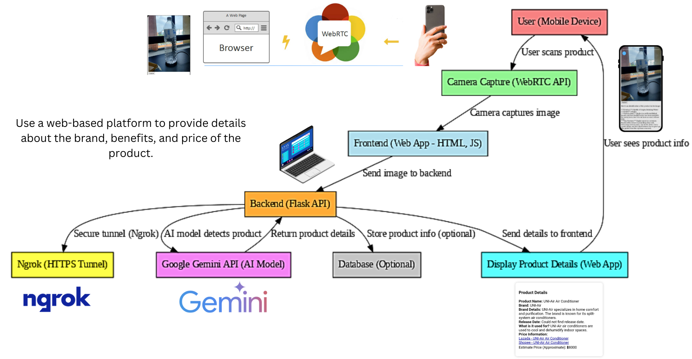

# ProdScan - AI-Based Product Identification System

Repo for demo idea, model, and code for ICT720 course of 2025.



## Team Members
1. Thanawin Ungkananuchat  
2. Sahatus Asawadilockchai  
3. Rady LY  

---

## **User Stories**
1. **As a consumer**, I want to scan any product using my smartphone camera, so that I can get details about it instantly.
2. **As a store manager**, I want to identify products in my inventory using AI, so that I can quickly check specifications and pricing.
3. **As a production operator**, I want to register and categorize products efficiently, so that I can optimize stock management.

---

## **Project Overview**
This project enables **real-time product recognition** using **a smartphone camera and AI**.  
Users can scan **any random product (electronics, food, household items, etc.)**, and the system will identify it using **Google Gemini API**, providing details like **brand, release date, price, and specifications**.

Additionally, this system integrates a **Phone Recognition & Price Estimation System**, leveraging machine learning for:
- **AI-based phone recognition** with EfficientNetB0.
- **Automated image collection** from SerpAPI.
- **Web scraping** for price estimation from Shopee, Lazada, and GSM Arena.
- **Web UI for real-time recognition and pricing information**.

---

## **Features**
- Scan any product using a smartphone camera.
- AI-based product recognition using Google Gemini API.
- Displays brand, release date, key specifications, and price (if available).
- Works on mobile devices without app installation.
- HTTPS support via Ngrok for remote access.
- **Integration with 5Strack IoT Development Kit WM8978** for QR display on ProdScan and online shop.
- **Phone recognition model** trained with EfficientNetB0 for classifying phone models.
- **Automated image collection** using SerpAPI for training data.
- **Price tracking** by scraping online stores.

---

## **System Workflow**
1. **Image Collection**: Scrapes images from online sources for training.
2. **Data Preprocessing**: Organizes images and splits them into training and validation sets.
3. **Model Training**: Uses EfficientNetB0 for phone classification.
4. **Prediction & Price Retrieval**: Identifies phone models from images and fetches price data.
5. **Web UI Display**: Presents recognition results and pricing information to users.

---
## **Web UI**
This is what you see when opening the web page. 


---

## **Scan Results**
When a user scans a product, the system displays the product details in real-time. Example result:


### **Example Output:**
- **Product Name**: Huawei Mate 50 Pro  
- **Brand**: Huawei  
- **Brand Details**: Huawei is a Chinese multinational technology corporation  
- **Release Date**: September 2022  
- **Usage**: High-end smartphone for communication, photography, entertainment, and productivity  
- **Price Information**: [Lazada - Huawei Mate 50 Pro](#), [Shopee - Huawei Mate 50 Pro](#)  
- **Estimate Price**: ฿40,990  

Videos demonstrating the scanning process will be available soon.

---

## **Machine Learning Model**
### Data Collection & Preparation
- Images of phones are collected using SerpAPI.
- Data is preprocessed by splitting it into training (70%) and validation (30%) sets.
- Augmentation techniques include rotation, flipping, zooming, and shifting to enhance model robustness.

### Model Architecture
- **Base Model**: EfficientNetB0 (pretrained on ImageNet, fine-tuned for phone recognition).
- **Custom Layers**:
  - GlobalAveragePooling2D
  - Dense (1024 units, ReLU activation)
  - Dropout (0.5)
  - Output layer (Softmax activation for classification)

### Training Strategy
- Optimizer: Adam with a learning rate of 0.0001
- Loss Function: Categorical Crossentropy
- Callbacks:
  - ModelCheckpoint (saves best model based on validation accuracy)
  - EarlyStopping (stops training if validation loss stagnates)
  - ReduceLROnPlateau (lowers learning rate if validation loss plateaus)

---

## **Database Schema**
The scanned product data is stored in an SQLite database with the following schema:

| Name            | Type    | Description |
|----------------|---------|-------------|
| id             | INTEGER | Unique ID (Primary Key) |
| product_name   | TEXT    | Name of the product |
| brand          | TEXT    | Product brand |
| brand_details  | TEXT    | Details about the brand |
| release_date   | TEXT    | Product release date |
| usage          | TEXT    | What the product is used for |
| price          | TEXT    | Estimated price |
| scan_time      | TEXT    | Timestamp of the scan |

---

## **Tech Stack**

| Component  | Technology Used |
|------------|----------------|
| **Frontend (Web UI)** | HTML, WebRTC API |
| **Backend (API Server)** | Flask (Python) |
| **AI Model (Product Recognition)** | Google Gemini API |
| **AI Model (Phone Recognition)** | EfficientNetB0 (TensorFlow/Keras) |
| **Camera Access** | WebRTC API (Back Camera) |
| **Secure Connection** | Ngrok (for HTTPS) |
| **Product Data Retrieval** | Web Scraping / External APIs |
| **Hardware Integration** | 5Strack IoT Dev Kit WM8978 |


---

## **Setup & Installation**

### **Prerequisites**
- Python 3.8+
- TensorFlow, Keras, Requests, BeautifulSoup, SerpAPI

### **Install Dependencies**
```bash
pip install -r requirements.txt
```

### **Run the Server**
```bash
python app.py
```

### **Access the Web Scanner**
Navigate to `http://localhost:5000` or use an Ngrok link for remote access.

---

## **Future Enhancements**
- Improve AI recognition accuracy
- Expand the dataset for broader product categories
- Enhance web scraping efficiency for faster price updates
- Implement user authentication for personalized product tracking
- Optimize QR tracking functionality for IoT integration

Let us know if you have any feedback or suggestions!
